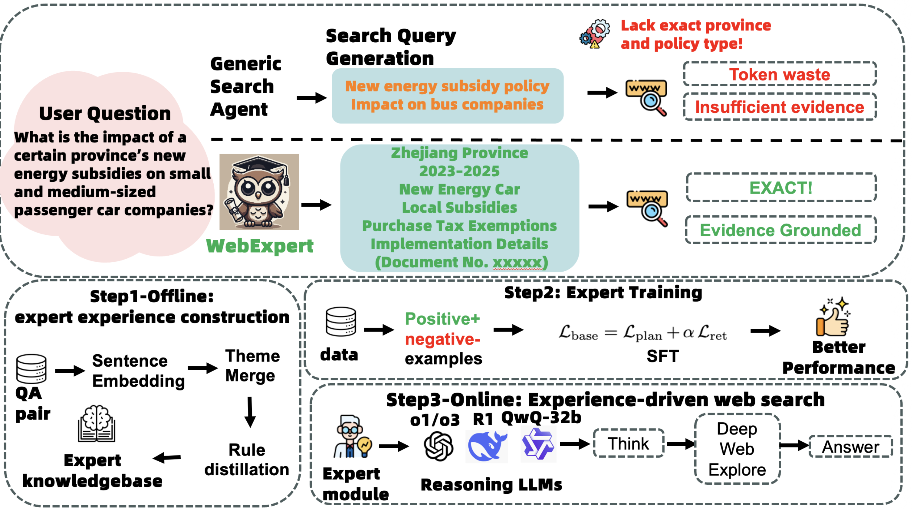

# WebExpert: Domain-Aware Web Agents with Critic-Guided Expert Experience for High-Precision Search

**Yuelin Hu**<sup>1</sup>, **Zhengxue Cheng**<sup>1</sup>, **Ronghua Wu**<sup>2</sup>, **Qunshan Gu**<sup>2</sup>, **Hongwei Hu**<sup>2</sup>, **Qiao Liang**<sup>3</sup>, **Wei Liu**<sup>4</sup>, **Li Song**<sup>1</sup>

<sup>1</sup> Shanghai Jiao Tong University &nbsp;&nbsp; <sup>2</sup> Ant Group &nbsp;&nbsp; <sup>3</sup> Shanghai Tongji University &nbsp;&nbsp; <sup>4</sup> Shanghai Maritime University

Published at ICASSP 2026. Code available at [https://github.com/huyuelin/WebExpert](https://github.com/huyuelin/WebExpert).

---

<p align="center">
  
</p>

## Overview

Specialized web tasks in finance, biomedicine, and pharmaceuticals remain challenging for current browsing agents due to missing domain priors: queries drift, evidence is noisy, and reasoning is brittle. WebExpert is a domain-aware web agent that integrates a critic-guided expert experience module before deep browsing. The module retrieves domain experiences and generates domain-grounded queries that steer a browsing controller toward high-precision retrieval. The core idea is a critic-guided extraction chain that converts annotated data and expert materials into reusable sentence-level experiences, merged into concise rules that generalize within a domain.

## Key Contributions

WebExpert makes five contributions toward domain-aware web browsing. First, it formulates domain-aware web browsing via a critic-guided extraction chain that injects sentence-level expert priors to steer query semantics along domain-relevant facets. Second, it presents a practical pipeline from sentence extraction and dense embedding to topic clustering, merging, and rule distillation using UMAP, HDBSCAN, and BERTopic. Third, it introduces schema-light facet induction that automatically induces facet vocabularies from weak supervision and corpus statistics, reducing manual schema dependence. Fourth, it proposes experience-conditioned planning with coverage-aware supervised fine-tuning, retrieval margin, and preference optimization, improving precision beyond generic RAG. Fifth, on GAIA, GPQA, HLE, and WebWalkerQA, WebExpert yields consistent 1.5 to 3.6 percentage-point EM gains over the strongest browsing baseline, with fewer page hops.

## Method

### Critic-Guided Expert Experience Extraction (Section 3.2)

The extraction pipeline proceeds in six stages. Question harvesting collects (question, answer, reasoning, citations) tuples and normalizes surface forms via paraphrase mining. QA-level multi-view clustering computes question, answer, and co-encoded representations, then groups QA tuples under a weighted similarity using HDBSCAN and BERTopic with soft assignments for overlapping intents. Evidence aggregation retains top-ranked pages via BM25 and dense retrieval, then applies Maximal Marginal Relevance for diversity and de-duplication. Contradiction-aware summarization uses DeepSeek-R1 to produce concise rules that include conditions, core guidance, edge cases, and known failure modes, filtering self-contradictory statements via entailment checks. Facetization assigns each rule to time, region, policy, and industry facets by filtering high-frequency domain terms and refining with shallow taggers and LLM disambiguation. Continuous refresh maintains the experience base as a versioned store with warm-start clustering and local merges.

The corresponding extraction code resides in [`webexpert/experience/extractor.py`](webexpert/experience/extractor.py), with the original extraction notebooks in [`critc_extraction/`](critc_extraction/).

### Schema-Light Facet Induction (Contribution iii)

Rather than relying on static hand-written lexicons, WebExpert automatically induces facet vocabularies from weak supervision and corpus statistics. High-frequency domain terms (e.g., CFA Institute for finance, FDA for biomedicine) are filtered via corpus statistics as facet candidates, then refined with shallow taggers and LLM disambiguation. This reduces manual schema dependence while preserving domain specificity. The implementation is in [`webexpert/experience/facet_inducer.py`](webexpert/experience/facet_inducer.py).

### Experience Gate with Confidence Fallback (Section 3.3)

During inference, a lightweight experience gate biases decoding toward active facets when retrieval confidence meets or exceeds a threshold (theta = 0.3, calibrated on the validation set). When confidence falls below the threshold, the gate falls back to generic query generation to avoid over-constraint. The gate is implemented in [`webexpert/experience/gate.py`](webexpert/experience/gate.py), and top-k experience retrieval is handled in [`webexpert/experience/retriever.py`](webexpert/experience/retriever.py).

### Preference-Optimized Planning (Section 3.4)

The planner is trained with a token objective weighted by facet alignment (L_plan), a contrastive retrieval margin (L_ret), coverage-aware SFT, and pairwise preference learning. Hard negatives are sampled from top-64 FAISS candidates with a score margin within 0.05, refreshed every epoch. Domain-grounded query generation is in [`webexpert/planning/domain_planner.py`](webexpert/planning/domain_planner.py), and preference optimization is in [`webexpert/planning/preference_optimizer.py`](webexpert/planning/preference_optimizer.py).

### Deep Web Explorer (Section 3.3, Step 3)

An iterative search-and-browse controller feeds the generated query plan to a browsing agent that interleaves retrieval and reasoning to produce the final answer. The controller is in [`webexpert/browsing/deep_explorer.py`](webexpert/browsing/deep_explorer.py).

## Installation

```bash
git clone https://github.com/huyuelin/WebExpert.git
cd WebExpert
pip install -r requirements.txt
```

Key dependencies include sentence-transformers, bertopic, hdbscan, umap-learn, scikit-learn, and pandas. A full list is available in [`requirements.txt`](requirements.txt).

## Quick Start

### Experience Extraction

Extract expert experiences from a dataset using the critic-guided pipeline:

```bash
# Extract from a single dataset
python run_extraction.py --dataset GAIA

# Extract from all supported datasets
python run_extraction.py --all

# Analyze dataset structure before extraction
python run_extraction.py --analyze
```

The extraction pipeline can also be used programmatically:

```python
from expert_experience_pipeline import UniversalExpertExtractor

extractor = UniversalExpertExtractor(
    dataset_name="GAIA",
    data_path="/path/to/GAIA",
    output_dir="expert_outputs/gaia",
    embedding_model="sentence-transformers/all-MiniLM-L6-v2",
)
expert_experiences = extractor.run_pipeline()
```

### Inference

Run WebExpert on a question with the expert experience module:

```bash
python run_inference.py --question "Your question here" --dataset GAIA
```

### Evaluation

Evaluate predictions using standard metrics (EM, F1, QP@3, Page Hops, nDCG@10):

```bash
python run_evaluation.py --predictions results.json --dataset GAIA
```

### Full Experiment Suite

Run experiments across all four benchmarks:

```bash
python run_experiments.py --benchmarks GAIA GPQA HLE WebWalkerQA
```

## Project Structure

```
WebExpert/
├── README.md
├── requirements.txt
├── run_inference.py                    # Main inference entry point
├── run_extraction.py                   # Experience extraction CLI
├── run_experiments.py                  # Experiment runner for 4 benchmarks
├── run_evaluation.py                   # Evaluation metrics
├── webexpert/
│   ├── __init__.py
│   ├── experience/
│   │   ├── extractor.py               # Critic-guided expert experience extraction (Sec 3.2)
│   │   ├── retriever.py               # Top-k experience retrieval (Sec 3.3 Step 1)
│   │   ├── facet_inducer.py           # Schema-light facet induction (Contribution iii)
│   │   └── gate.py                    # Experience gate with confidence fallback (Sec 3.3 Step 2)
│   ├── planning/
│   │   ├── domain_planner.py          # Domain-grounded query generation (Sec 3.3 Step 2)
│   │   └── preference_optimizer.py    # Preference-optimized planning with SFT/DPO (Sec 3.4)
│   ├── browsing/
│   │   └── deep_explorer.py           # Deep web explorer sub-agent (Sec 3.3 Step 3)
│   ├── evaluation/
│   │   └── metrics.py                 # EM, F1, QP@3, Page Hops, nDCG@10
│   ├── llm/
│   │   └── client.py                  # LLM API client
│   ├── prompts/
│   │   └── templates.py               # Prompt templates
│   └── data/
│       ├── download_gaia.py
│       ├── download_gpqa.py
│       └── loader.py                  # Dataset loading utilities
├── critc_extraction/                   # Original extraction notebooks and outputs
│   ├── extract_embedding.ipynb
│   ├── extract_sentences.ipynb
│   ├── merge_topic.ipynb
│   ├── critic_generation.py
│   └── topic_generation.py
├── assets/
│   ├── framework.png                   # Paper framework diagram
│   └── poster.pdf                      # ICASSP 2026 poster
└── scripts/                            # Legacy scripts (credit domain agent, DPO, etc.)
```

## Main Results

WebExpert outperforms strong baselines on Answer Exact Match across four benchmarks under standardized settings. All systems query the same Bing API with identical decoding hyperparameters.

| Method | GAIA EM | GPQA EM | HLE EM | WebWalkerQA EM |
|--------|---------|---------|--------|----------------|
| QwQ-32B (Direct) | 13.6 | 43.4 | 5.4 | 3.1 |
| RAG-QwQ-32B | 32.0 | 64.6 | 7.2 | 31.2 |
| Search-o1-32B | 39.8 | 67.2 | 10.8 | 34.1 |
| WebThinker-32B-Base | 44.7 | 68.7 | 13.0 | 41.9 |
| WebExpert (ours) | 46.2 | 70.2 | 14.5 | 43.7 |
| WebExpert+SFT | 47.7 | 71.9 | 16.6 | 46.3 |

WebExpert improves QP@3 from 49.3 (WebThinker) to 58.2 (WebExpert) and 61.8 (WebExpert+SFT), while page hops drop from 8.1 to 5.6 and 5.2 respectively. Evidence nDCG@10 improves by 4 to 6 points across datasets.

## Ablation Studies

Ablation experiments on GAIA demonstrate the contribution of each component. Sentence-level embeddings and SFT contribute the most, while retrieving top-5 experiences balances precision and coverage.

| Variant | EM (%) | QP@3 (%) |
|---------|--------|----------|
| WebExpert (full) | 47.7 | 61.8 |
| w/o SFT | 46.2 | 58.2 |
| w/o topic merging | 44.1 | 59.1 |
| w/o sentence-level embedding | 45.7 | 56.0 |
| top-k=1 (vs. 5) | 41.2 | 57.1 |

## Training Details

Training uses approximately 12k preference-aligned pairs curated from expert rules and browsing trajectories, where positives emphasize facet-aligned plans and negatives suppress off-facet or redundant plans. Full-parameter fine-tuning of QwQ-32B uses Pai-Megatron-Patch with a learning rate of 1e-5, cosine decay, and beta2 of 0.98. Validation uses QP@3 and EM on held-out GAIA items with early stopping. For the contrastive retrieval objective, hard negatives are sampled from top-64 FAISS candidates excluding positives, with a score margin within 0.05, refreshed every epoch.

## Citation

```bibtex
@inproceedings{hu2026webexpert,
  title     = {WebExpert: Domain-Aware Web Agents with Critic-Guided Expert Experience for High-Precision Search},
  author    = {Hu, Yuelin and Cheng, Zhengxue and Wu, Ronghua and Gu, Qunshan and Hu, Hongwei and Liang, Qiao and Liu, Wei and Song, Li},
  booktitle = {Proceedings of the IEEE International Conference on Acoustics, Speech and Signal Processing (ICASSP)},
  year      = {2026}
}
```

## Acknowledgment

This work uses BERTopic, HDBSCAN, UMAP, and Sentence Transformers for topic modeling, clustering, dimensionality reduction, and embedding generation respectively. The fine-tuning framework builds on Pai-Megatron-Patch. We thank the anonymous reviewers for their constructive feedback.

## Poster

<p align="center">
  <a href="assets/poster.pdf">
    
  </a>
</p>

Click the image above or access the full poster at [`assets/poster.pdf`](assets/poster.pdf).
